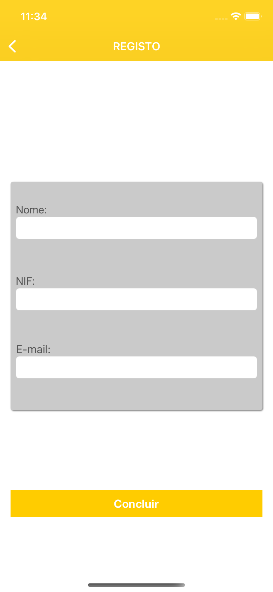

# TechOClock


## Sobre
Este exemplo de app foi desenvolvido como parte da apresentação do TechOClock promovido pela ITSector.
A  apresentação consiste em mostrar como podemos desenvolver testes automáticos com a ferramenta [Appium](https://appium.io/), utilizando [Kotlin](https://kotlinlang.org/).  





## Configuração
- Instale o [NodeJS](https://nodejs.org/en/)
- Instale o [IntelliJ IDEA](https://www.jetbrains.com/idea/) 
- Instale o Appium

```
npm install -g appium
```

- Verifique sua instalação usando 

```
npm install -g appium-doctor

appium-doctor
```

E finalmente, inicie o Appium server

```
appium
```

## Android


- Verificar a versão do Java
```
/usr/libexec/java_home -V
```

- Editar o arquivo .bash_profile (criar caso não exista)
> vim bash_profile

```
export ANDROID_HOME=/Users/<user>/Library/Android/sdk
export PATH=$ANDROID_HOME/platform-tools:$PATH
export PATH=$ANDROID_HOME/tools:$PATH
export PATH=$ANDROID_HOME/emulator:$PATH
export JAVA_HOME=$(/usr/libexec/java_home -v "15.0.2")
```
> source bash_profile


## Resumo rápido

```
> brew install node      # get node.js
> npm install -g appium  # get appium
> npm install wd         # get appium client
> appium &               # start appium
```


## Principais Temas
- Correr os testes no simulador iOS
- Correr testes com .apk local
- Escrita de testes para ambas plataformas


## Features Secundárias
- Escrita de testes para apps desenvolvidas em Flutter


